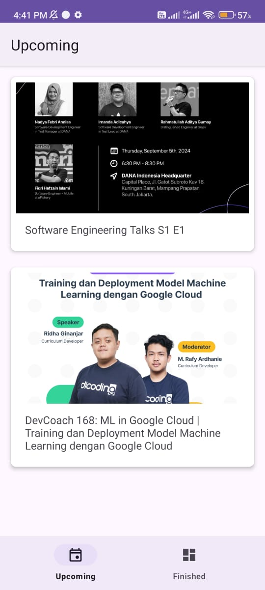
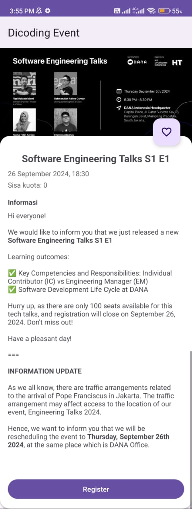
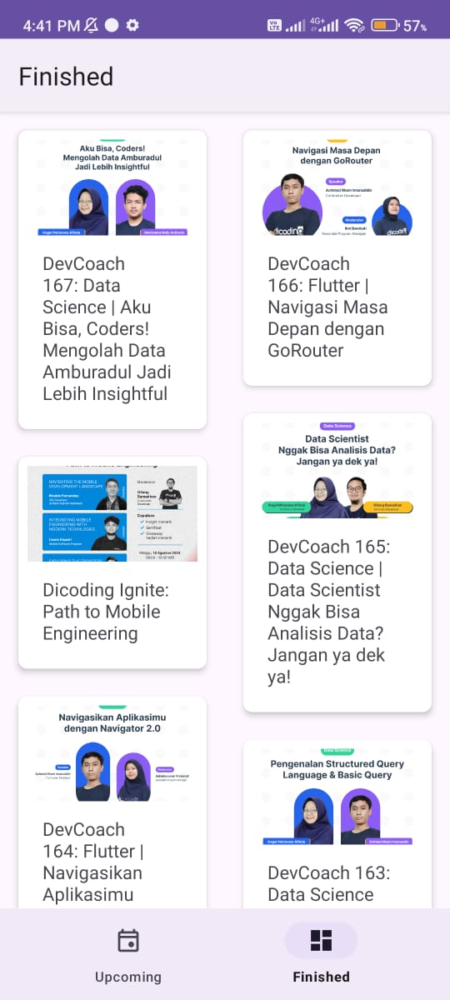
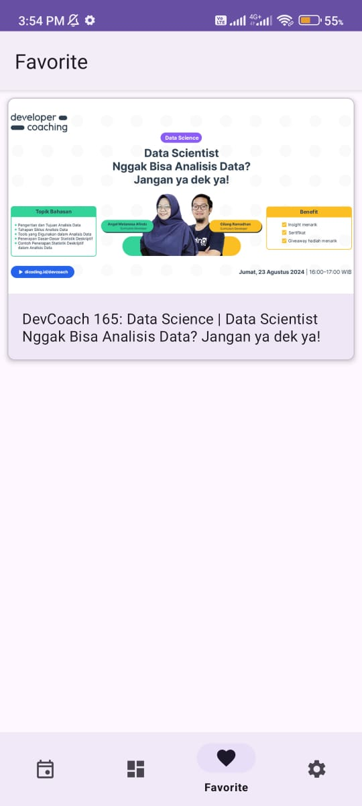
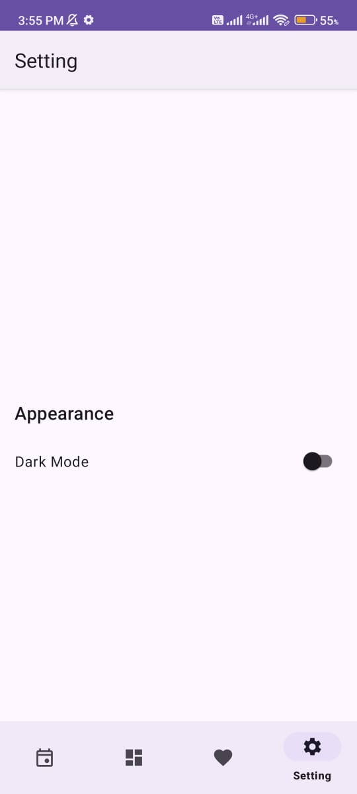
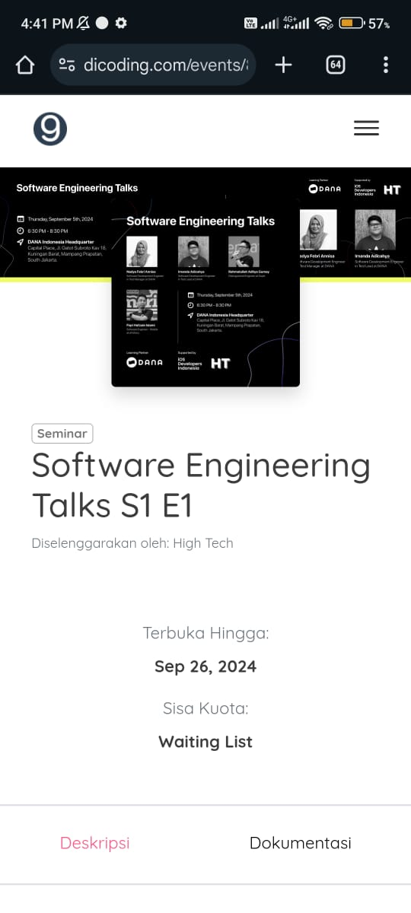
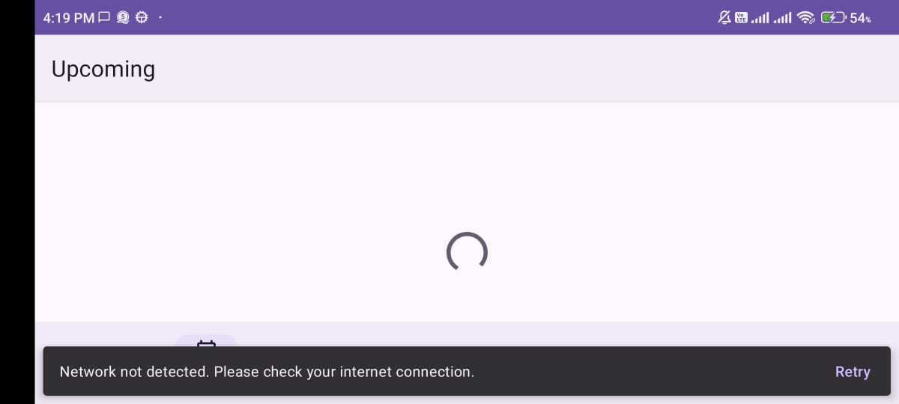

# Dicoding Event 🥳

**Dicoding Event** is a simple Android app shows a list of event from [Dicoding Indonesia](https://www.dicoding.com/events). The app allows users to view event details and manage their registrations.

## Demo 🪟 

<p align="center">
  
  
  
  
</p>

<p align="center">
  
  
  
</p>

## Tools ⚙️ 

- **Android Studio Iguana**
- **Gradle**
- **OpenJDK**
- **Kotlin**
- **Room**
- **etc**

## Installation 🛠️

1.  **Clone the Repository**:
   ```bash
   git clone https://github.com/raflizocky/dicoding-event.git
   ```
2. Open the Project in Android Studio
3. Run the App

---
